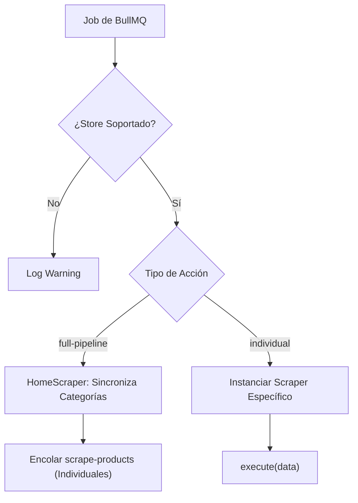
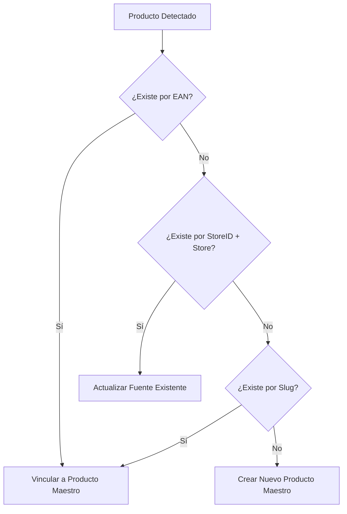

# Arquitectura del Sistema de Scrapers

Este documento describe el motor de scraping centralizado del proyecto, diseñado para ser escalable, resiliente y eficiente en la recolección de precios de múltiples supermercados.

## 1. Diseño Orientado a Nodos

El sistema utiliza una arquitectura basada en **Nodos de Scraping** que heredan de una clase base común.

### Diagrama de Arquitectura General
```mermaid
graph TD
    Admin["Admin Panel (Frontend)"] -->|Trigger Job| API["Backend API (Express)"]
    API -->|Encolar Trabajo| Redis[("Redis (BullMQ)")]
    Redis -->|Poll/Consumir| Workers["Scraper Workers (Aislados por Store)"]
    Workers -->|Despachar| Dispatcher["Scraper Dispatcher"]
    Dispatcher -->|Instanciar| Scrapers["Store Scrapers (Playwright)"]
    Scrapers -->|API Request (Node Context)| Super["Supermarket APIs (VTEX/Etc)"]
    Scrapers -->|Upsert| DB[("MongoDB")]
```

### Componentes Clave:
- **[BaseScraper](file:///home/santt/Documentos/GitHub/new-caminando/backend/src/scrapers/BaseScraper.ts)**: Clase abstracta que gestiona:
    - Inicialización y cierre de Playwright.
    - Capturas de pantalla automáticas cada 10 segundos para monitoreo.
    - Manejo de errores y logging centralizado.
    - Respeto a los límites de tasa (Rate Limiting) mediante retardos configurables.
- **[IScraperNode](file:///home/santt/Documentos/GitHub/new-caminando/backend/src/scrapers/interfaces/IScraperNode.ts)**: Interfaz que define el contrato de ejecución (`execute`, `canHandle`).

## 2. Gestión de Colas y Aislamiento

### Orquestación (Dispatcher)
El [ScraperDispatcher](file:///home/santt/Documentos/GitHub/new-caminando/backend/src/workers/scraper.dispatcher.ts) es el cerebro que decide qué instancia de scraper debe procesar cada trabajo.



## 3. Estrategia de Vinculación por EAN (Comparación de Precios)

El objetivo principal es permitir la comparación del mismo producto entre diferentes tiendas.

### Flujo de Vinculación Priorizada



## 5. Prácticas de Estabilidad (Node Context API)

Para evitar la detección de bots y fallos en el navegador, las llamadas a las APIs de los supermercados (VTEX) se realizan desde el **contexto de Node.js** utilizando `this.page.context().request.get()`, evitando ejecutar JavaScript pesado dentro del DOM de la página siempre que sea posible.
