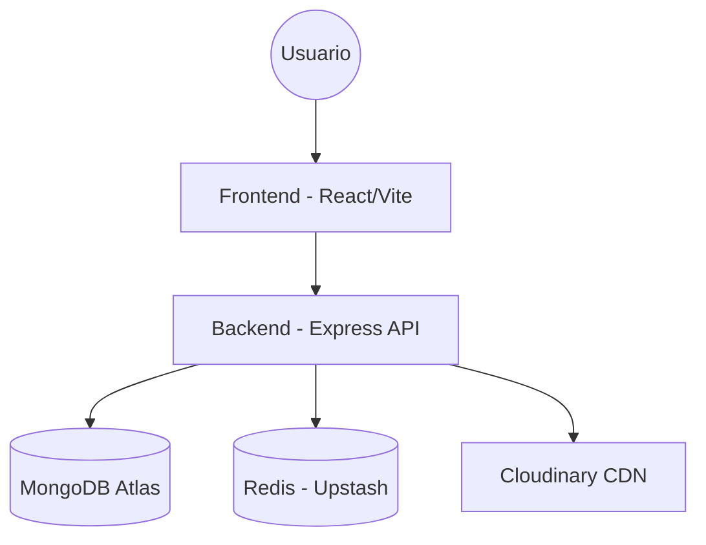
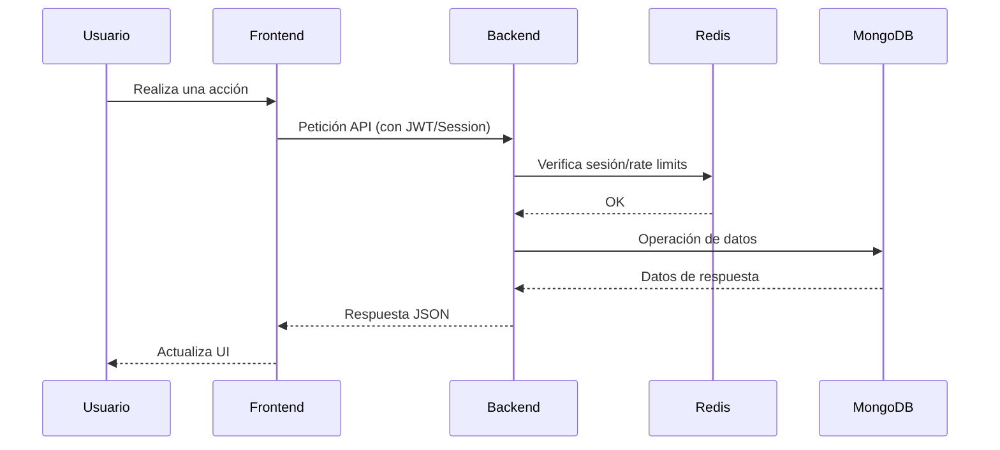

# 01 - Arquitectura y Stack Tecnológico

Este documento describe la arquitectura de alto nivel del proyecto y las decisiones tecnológicas que permiten su ejecución en entornos serverless con alta disponibilidad.

## Visión General de la Arquitectura

El proyecto utiliza un modelo de monorepo simplificado donde el **Backend** y el **Frontend** coexisten pero mantienen responsabilidades separadas.

## Arquitectura de Archivos (Directory Structure)

El proyecto mantiene una separación clara entre la lógica del servidor y la interfaz de usuario.

### Estructura General
- `/backend`: Servidor API Express.
  - `src/config`: Configuraciones de entorno (env), Redis y Cloudinary.
  - `src/middlewares`: Seguridad (securityGuard), Sesiones (sessionManager) y Auditoría (trackRequest).
  - `src/models`: Esquemas de Mongoose (User, Session, Ticket, IPRule, Activity, etc).
  - `src/routes`: Definición de rutas y lógica de controladores integrada.
    - `panel/`: Rutas administrativas protegidas.
    - `api/`: (No presente, rutas raíz como auth.ts, images.ts, support.ts).
  - `src/services`: Lógica de soporte (tracking de imágenes, ipGuide, **analyticsService**, **CleanupService**).
  - `src/utils`: Helpers globales (asyncHandler, response).
- `/frontend`: Aplicación React + Vite.
  - `src/assets`: Multimedia y estilos.
  - `src/components`: UI Atómica y compartida.
  - `src/contexts`: Gestión de estado (Auth, Theme, Tour, AdminAuth).
  - `src/hooks`: Lógica de UI reusable (**useAttribution**, etc).
  - `src/pages`: 
    - `admin/`: Módulos del panel (users, tickets, database, security, settings, **campaigns**).
    - `public/`: Vistas de login, registro y **contacto**.
  - `src/schemas`: Validaciones Zod.
  - `src/services`: Clientes de API (**campaigns.ts**, **tickets.service.ts**, etc).
  - `src/utils`: Helpers.

## Stack Tecnológico

### Frontend
- **React 19 & Vite**: Para un renderizado rápido y una experiencia de desarrollo ágil.
- **Tailwind CSS 4**: Estilizado moderno con alto rendimiento.
- **Radix UI & Shadcn/UI**: Componentes accesibles y altamente personalizables.
- **TanStack Query**: Gestión inteligente de estado asíncrono y cacheo.

### Backend
- **Node.js & Express**: API REST en TypeScript, diseñada para ser *stateless* y compatible con Vercel/Railway. Utiliza middlewares especializados para identidad (`identifyUser`), persistencia de visitantes (`sessionManager`) y protección perimetral (`securityGuard`).
- **TypeScript**: Tipado estricto para reducir errores en producción.
- **Mongoose**: Modelado de datos elegante para MongoDB.
- **Redis**: Gestión de sesiones ultra-rápida y seguridad reactiva.

## Optimización Serverless

El sistema está diseñado específicamente para superar las limitaciones de los entornos serverless (ej. Vercel Functions):

1.  **Statelessness Absoluto**: El backend no almacena datos en memoria local. Todo estado de sesión o caché se delega a **Redis**, asegurando que cualquier instancia de la función pueda responder correctamente.
2.  **Gestión de Conexiones**: Se implementan patrones de "singleton" para las conexiones a bases de datos, reutilizando clientes para minimizar la latencia de inicialización (cold starts).
3.  **Cold Start Mitigation**: El backend es ligero y las rutas están optimizadas para una carga rápida.

## Flujo de Datos General

