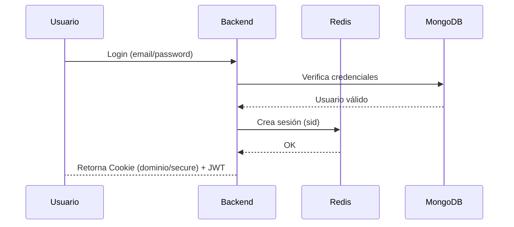
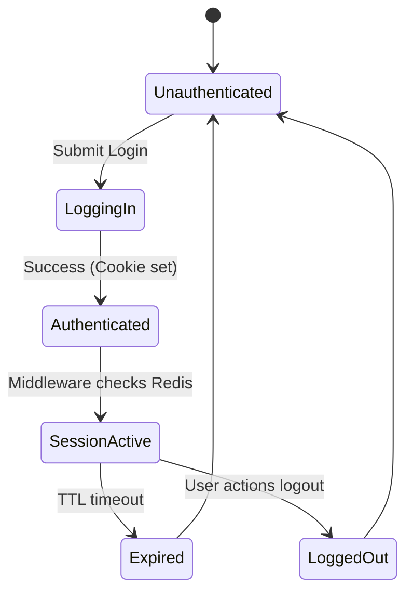

# 02 - Autenticación y Gestión de Sesiones

El sistema utiliza un esquema híbrido de seguridad que combina la flexibilidad de los JWT con la seguridad y el control de sesiones en tiempo real mediante Redis.

## Seguimiento y Persistencia de Sesión

### Identificación de Visitantes (`v_token`)
Incluso antes de que un usuario inicie sesión, el sistema asigna una identidad persistente:
- **Middleware**: `sessionManager.ts`.
- **Mecanismo**: Una cookie de solo lectura (`v_token`) con una duración de **2 años**.
- **Propósito**: Vincular la actividad histórica de un usuario anónimo una vez que decide registrarse o iniciar sesión, permitiendo análisis forense y de comportamiento.

### Tokens de Sesión Volátiles (`s_token`)
Además de la sesión de usuario autenticado, se mantiene un `s_token` por pestaña/navegador:
- Permite diferenciar múltiples sesiones de navegación del mismo visitante.
- Se transmite vía Cookies o el header `x-session-id`.

### Identificación por Headers (Proxy Trust)
Para entornos como Vercel, el sistema está preparado para confiar en headers de identidad inyectados por el gateway:
- `x-user-id` o `x-sub`: Identifican al usuario autenticado.
- Procesado por el middleware `identifyUser.ts`.

## Flujo de Autenticación

El proceso asegura que la identidad del usuario sea verificada tanto en el transporte (JWT) como en el almacenamiento de sesión persistente.

## Rotación de Tokens y Seguridad de Sesión

El sistema implementa un esquema de **Refresh Token Rotation** para maximizar la seguridad:

1.  **Vínculo por Dispositivo**: Cada sesión está ligada a un `deviceId`. El sistema permite múltiples sesiones concurrentes para un mismo usuario, pero cada una tiene su propio ciclo de vida y token independiente.
2.  **Identificador Único (`jti`)**: Cada `refreshToken` emitido contiene un identificador único en su payload (`jti`). Este debe coincidir exactamente con el campo `refreshTokenId` guardado en el modelo `Session` de MongoDB.
3.  **Rotación en cada Uso**: Al invocar el endpoint `/refresh`:
    - El sistema valida el token actual y su firma.
    - Genera un nuevo `refreshTokenId` aleatorio.
    - Actualiza la sesión en la base de datos con el nuevo ID.
    - Emite un **nuevo Refresh Token** y lo sobreescribe en la cookie `httpOnly`.
    - Retorna un nuevo `accessToken` de corta duración (15 min).
4.  **Detección de Reúso**: Si un atacante intenta utilizar un Refresh Token antiguo (robado y ya rotado), el `jti` no coincidirá con el actual de la sesión, lo que permite invalidar la sesión completa para proteger al usuario.

## Endurecimiento de Tokens (Hardening)

Para proteger los datos sensibles incluso ante una brecha en la base de datos:
- **Hashing de Tokens**: Los tokens de verificación de email y restablecimiento de contraseña se almacenan como **Hashes SHA-256**. El servidor solo conoce el hash; el token original solo existe en el correo enviado al usuario.
- **Expiración Estricta**:
    - **Verificación de Email**: 24 horas.
    - **Reset de Password**: 1 hora.
- **Un solo uso**: Una vez utilizado exitosamente, el token (hash) se elimina inmediatamente del perfil del usuario.

## Resiliencia en el Frontend

La experiencia de usuario se ha optimizado para mantener la sesión de forma invisible:
1.  **Silent Refresh**: Al montar la aplicación (`App.tsx`), el sistema intenta recuperar un Access Token usando el Refresh Token de la cookie `httpOnly`.
2.  **Axios Interceptors**: Se ha implementado un interceptor de respuesta que captura errores `401 (Unauthorized)`. Si ocurre, el sistema intenta refrescar el token en segundo plano y reitenta la petición original sin que el usuario lo note.

## Especificaciones Técnicas

### Esquemas de Datos (Mongoose)
- **Modelo `User`**:
    - `email`, `name`, `passwordHash` (Bcrypt).
    - `role`: `user` o `admin`.
    - `isActive`: Boolean para control de acceso.
    - `profile`: Datos personales (firstName, phone, address, etc).
- **Modelo `Session`**: 
    - `userId`: Referencia al ID del usuario.
    - `deviceId`: Identificador único de dispositivo.
    - `refreshTokenId`: ID del token de refresco actual.
    - `userAgent` / `ip`: Metadata para auditoría.
    - `revokedAt`: Fecha de revocación (Null si activa).

### Endpoints de la API
#### Público (`/auth`)
- `POST /login`: Inicio de sesión para usuarios generales.
- `POST /register`: Registro de nuevos usuarios.
- `POST /refresh`: Renovación de Access Token usando Refresh Cookie.
- `POST /logout`: Cierre de sesión (revoca en DB).
- `GET /me`: Obtiene perfil del usuario autenticado.

#### Administrativo (`/panel/auth`)
- `POST /login`: Autenticación específica para el panel (usa `adminEmail` de env).
- `GET /me`: Perfil del administrador actual.

### Arquitectura de Archivos del Módulo
- **Backend**:
  - `src/models/User.ts`, `src/models/Session.ts`
  - `src/routes/auth.ts`, `src/routes/panel/auth.ts`
  - `src/middlewares/sessionManager.ts`
- **Frontend**:
  - `src/contexts/AuthContext.tsx`, `src/contexts/AdminAuthContext.tsx`
  - `src/pages/public/login/login.tsx`
  - `src/pages/public/register/register.tsx`

## Componentes Críticos

### Backend: Gestión de Identidad
1.  **sessionManager**: Middleware que conecta con Redis para recuperar los datos de la sesión actual basados en la cookie recibida.
2.  **identifyUser**: Extrae y decodifica el JWT para inyectar el objeto `user` en la petición recurrente.
3.  **Cookies HttpOnly**: Los tokens no son accesibles vía JavaScript, mitigando ataques XSS.
4.  **Trazabilidad de Sesión**: Cada registro de `Activity` (logs) inyecta el `sessionId` actual. Esto permite correlacionar acciones específicas con una "ventana de navegación" única del usuario.

### Frontend: Contextos de Seguridad
- **AuthContext**: Gestiona el estado de autenticación para usuarios normales.
- **AdminAuthContext**: Provee una capa extra de seguridad para el panel operativo, verificando roles de administrador.
- **ProtectedRoutes**: Componentes que envuelven las rutas del sistema, redirigiendo al login si no hay sesión válida.

### Auditoría de Identidad 360°
Cada evento de autenticación y cambio en la cuenta es ahora auditado de forma persistente:
- **Login/Logout**: Registro con IP y geolocalización automática.
- **Gestión de Perfil**: Auditoría de cambios en datos personales, preferencias y configuración con tracking de IP.
- **Seguridad**: Registro de cambios de contraseña exitosos y fallidos con alerta de riesgo geográfica.

## Ciclo de Vida de la Sesión

## Ventajas del Esquema
- **Revocación Inmediata**: Al usar Redis, un administrador puede invalidar una sesión instantáneamente sin esperar a que el JWT expire.
- **Persistencia**: El usuario permanece logueado incluso si el servidor se reinicia o se despliega una nueva versión (gracias a Redis).
- **Seguridad**: Doble validación (JWT + SessionID) para operaciones críticas.
