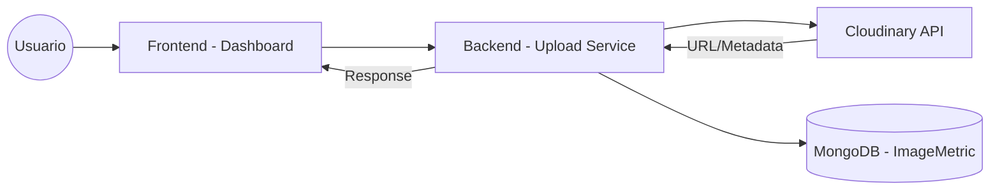
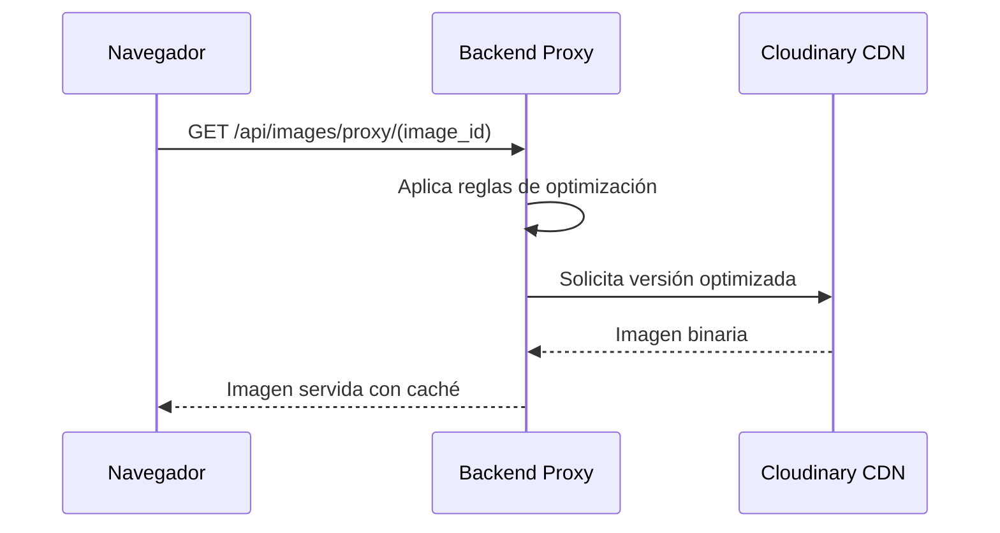

# 03 - Gestión de Imágenes y Media

Este módulo centraliza la subida, optimización, entrega y métricas de todos los recursos visuales del proyecto utilizando Cloudinary como motor principal.

## Flujo de Subida y Procesamiento

El sistema no solo sube la imagen, sino que registra su ciclo de vida para auditoría y optimización de costos.

## Especificaciones Técnicas

### Esquemas de Datos (Mongoose)
- **Modelo `ImageMetric`**:
    - `publicId`: ID de Cloudinary.
    - `format`, `width`, `height`, `bytes`: Metadata técnica.
    - `views`, `downloads`, `proxyRequests`: Contadores de uso.
    - `events`: Array de accesos detallados (IP, UserAgent, CacheHit).
- **Modelo `ImageProxyConfig`**:
    - `isActive`: Toggle global del proxy.
    - `cacheEnabled`, `trackingEnabled`: Control de features.
    - `cacheTTL`, `cacheMaxSize`: Reglas de almacenamiento.
    - `allowedDomains`: Lista de dominios para Hotlink Protection.

### Endpoints de la API
#### Público (`/images`)
- `GET /:publicId`: Proxy directo que sirve la imagen desde Cloudinary o Cache con tracking.

#### Administrativo (`/panel/cloudinary`)
- `GET /images`: Lista recursos en Cloudinary.
- `POST /upload`: Sube imagen y retorna URL del proxy.
- `GET /stats`: Estadísticas globales de Cloudinary.

#### Administrativo Proxy (`/panel/cloudinary/proxy`)
- `GET /config`: Obtiene configuración actual.
- `PUT /config`: Actualiza reglas de cache, tracking y seguridad.
- `GET /stats`: Métricas de ahorro y tráfico del proxy.

### Arquitectura de Archivos del Módulo
- **Backend**:
  - `src/models/ImageMetric.ts`, `src/models/ImageProxyConfig.ts`
  - `src/routes/images.ts` (Proxy Público)
  - `src/routes/panel/cloudinary.ts`, `src/routes/panel/imageProxy.ts` (Administración)
- **Frontend**:
  - `src/pages/admin/database/cloudinary/CloudinaryDashboard.tsx`
  - `src/pages/admin/database/cloudinary/uploader/`

### Caché en Redis (Proxy Adaptativo)
Para minimizar las peticiones a Cloudinary y reducir la latencia, el proxy utiliza Redis como capa de almacenamiento temporal:

- **Mecanismo**: Las imágenes se almacenan como cadenas **Base64** en Redis.
- **Doble Llave**: Se utiliza `image:{publicId}` para el binario y `image:{publicId}:type` para el `Content-Type`.
- **Límites de Seguridad**:
    - **TTL Configurable**: El tiempo de vida se define en `ImageProxyConfig` (ej: 24h).
    - **Tamaño Máximo**: Para evitar saturar la memoria de Redis, solo se cachean imágenes que no superen el `cacheMaxSize` (ej: 5MB).
- **Encabezados HTTP**: El sistema inyecta el header `X-Cache: HIT` cuando la imagen proviene de Redis, permitiendo auditar el ahorro de tráfico.

### Protección y Rate Limiting (Capa Redis)
Para prevenir el abuso del ancho de banda y ataques de denegación de servicio (DoS), el sistema implementa límites estrictos:

- **Contadores Temporales**: Se mantienen llaves en Redis por IP (`ratelimit:{ip}:{minute/hour/day}`) para controlar el tráfico.
- **Umbrales Dinámicos**: Los límites se configuran desde el panel y permiten definir cuántas imágenes puede solicitar un usuario por minuto, hora o día.
- **Whitelist/Blacklist**: Soporte para omitir límites en IPs de confianza o bloquear permanentemente IPs maliciosas detectadas.

### Auto-bloqueo Inteligente
El motor de tracking analiza patrones sospechosos en tiempo real:
- **Detección de Abuso**: Si una IP supera un umbral de peticiones sobre una misma imagen en 1 hora, el sistema la etiqueta como sospechosa.
- **Bloqueo Automático**: Se activa una regla en el `IPRule` para denegar el acceso a toda la infraestructura, persistiendo el bloqueo en Redis para una respuesta de 0ms en futuros intentos.
- **Alertas**: Notificaciones automáticas (vía Webhooks) cuando se detecta y bloquea un patrón de ataque.

### Caché en el Frontend (Nativo del Navegador)
La aplicación frontend no implementa un almacenamiento binario personalizado (como IndexedDB) para las imágenes. En su lugar, aprovecha el **motor de caché del navegador** mediante una integración coordinada con el backend:

- **Cabeceras de Control**: El Proxy del backend inyecta los encabezados `Cache-Control: public, max-age=...` y `ETag` basándose en la configuración de `ImageProxyConfig`.
- **Persistencia Local**: El navegador almacena las imágenes en su caché de disco/memoria, lo que permite que las imágenes se carguen instantáneamente en visitas recurrentes sin consumir ancho de banda adicional ni recursos de Redis.
- **Validación**: El uso de URLs basadas en el `publicId` asegura que, si una imagen se actualiza en Cloudinary con el mismo ID, el caché se invalide correctamente según los tiempos de vida (TTL) configurados.

## Características Principales

### Backend: Seguimiento y Proxy
- **Servicio de Tracking**: `imageTracking.ts` registra cada subida, transformación y eliminación.
- **ImageProxy**: Permite servir imágenes a través de rutas controladas para aplicar transformaciones personalizadas y cacheo adicional.
- **Modelos de Datos**:
  - `ImageMetric`: Almacena dimensiones, peso, formato y uso de cada recurso.
  - `ImageProxyConfig`: Define reglas de transformación dinámicas.

### Frontend: Panel de Control de Media
- **Galería**: Visualización centralizada de todos los recursos en la nube.
- **Optimizador**: Herramientas integradas para ver cómo las transformaciones afectan el peso y la calidad en tiempo real.
- **Uploader**: Componente modular con soporte para drag-and-drop y previsualización.

## Flujo de Entrega (Proxy)

## Auditoría de Imágenes
Cada imagen cuenta con métricas asociadas que permiten a los administradores identificar recursos innecesariamente pesados o que ya no están en uso, optimizando el rendimiento LCP (*Largest Contentful Paint*) del sitio.
