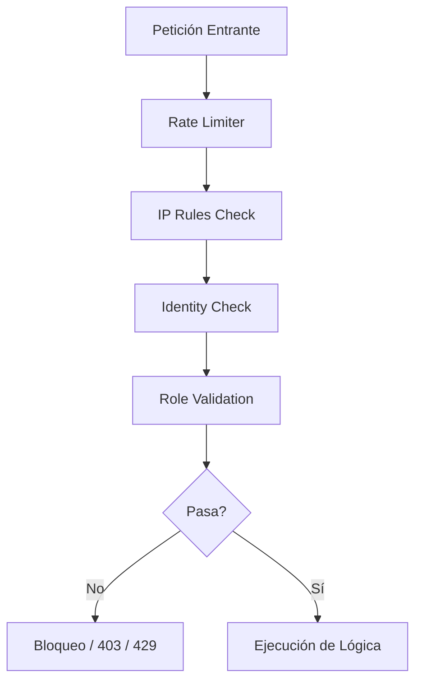
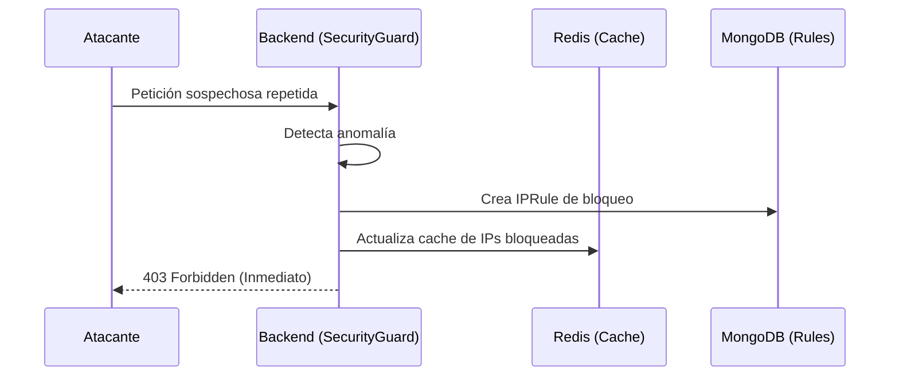

# 04 - Seguridad Avanzada y Protección de Rutas

La seguridad del sistema es una capa transversal que protege tanto la integridad de los datos como la disponibilidad del servicio ante ataques coordinados.

## El "Security Guard"

Este es el componente central de defensa en el backend. Actúa como un firewall a nivel de aplicación (WAF).

## Especificaciones Técnicas

### Esquemas de Datos (Mongoose)
- **Modelo `IPRule`**:
    - `ip`: Dirección IPv4/IPv6.
    - `type`: `whitelist` o `blacklist`.
    - `reason`: Motivo del bloqueo (ej. "Brute force attack").
    - `createdBy`: ID del administrador que creó la regla.

### Endpoints de la API (`/api/panel/security`)
- `GET /ip-rules`: Lista de todas las reglas de IP registradas.
- `POST /ip-rules`: Crea o actualiza una regla de bloqueo o permiso.
- `DELETE /ip-rules/:id`: Elimina una regla específica.

#### Analítica de Amenazas (incluido en `/api/panel/analytics`)
- `GET /threats`: Resumen de ataques detectados y distribución geográfica.
- `GET /logs`: Auditoría detallada de accesos sospechosos.

### Arquitectura de Archivos del Módulo
- **Backend**:
  - `src/models/IPRule.ts`
  - `src/middlewares/securityGuard.ts`, `src/middlewares/rateLimiter.ts`
  - `src/routes/panel/security.ts`
- **Frontend**:
  - `src/pages/admin/security/SecurityPage.tsx`
  - `src/pages/admin/security/ThreatAnalysis.tsx`
  - `src/pages/admin/security/SecuritySettings.tsx`

## Mecanismos de Defensa

### Backend: Reglas Dinámicas e IPs
1.  **IPRule Management**: Un sistema que permite bloquear IPs de forma manual o automática basadas en comportamiento sospechoso (ej. demasiados errores de login).
2.  **Rate Limiting Estricto**: 
    - **API Global**: Límites estándar para evitar DoS.
    - **Auth Routes**: Las rutas de login y recuperación tienen un límite estricto de **10 peticiones por hora**. Superar este límite dispara un bloqueo automático de 24 horas mediante Sentinel.
3.  **Honeypots (Trampas)**: El sistema vigila rutas sensibles utilizadas por bots (ej. `/wp-admin`, `.env`, `/phpmyadmin`). Cualquier intento de acceso a estas rutas resulta en un bloqueo permanente automático.
4.  **Auditoría**: Cada bloqueo o evento de seguridad se registra en la base de datos para su posterior análisis.
5.  **Sentinel Risk Score (Detección de Enumeración)**: El sistema calcula un puntaje de riesgo dinámico e identifica ataques dirigidos:
    - **Multi-Account Reset**: Sentinel rastrea si una misma IP intenta restablecer la contraseña de múltiples emails distintos. Si el objetivo supera las 3 cuentas en **24 horas**, la IP recibe una penalización de alto riesgo (+5) y baneo inmediato si alcanza el umbral.
    - **IP Risk Score**:
        - Cantidad de IPs únicas asociadas a un mismo usuario (+5 pts por IP).
        - Eventos sospechosos o bloqueos previos (+10 pts por evento).
        - IPs ya presentes en la blacklist (100 pts inmediatos).

### Funcionamiento del Honeypot
El middleware `honeypot` intercepta peticiones antes de que lleguen a los controladores. Si una ruta coincide con el inventario de trampas:
1. Se identifica la IP del atacante.
2. Se crea una regla en `IPRule` con tipo `blacklist`.
3. Se sincroniza con el caché de Redis para bloqueo inmediato.
4. Se registra un evento `THREAT` en los logs de actividad.

### Protección de Operaciones Destructivas
Para evitar accidentes o acciones malintencionadas, las operaciones críticas requieren la **Contraseña del Super Administrador** (`ADMIN_PASSWORD`) incluso si el usuario ya tiene una sesión activa:
- **Bases de Datos**: Borrado de colecciones, documentos y vaciado de Redis.
- **Mantenimiento**: Ejecución de la **Limpieza Profunda del Sistema**.
- **Seguridad**: Modificaciones críticas en reglas de IP.

### Frontend: Seguridad en la Interfaz
- **Página de Seguridad**: Dashboard administrativo con métricas de bloqueo en tiempo real.
- **Visualización Geográfica**: La lista de logs ahora incluye directamente la ubicación (Ciudad, País) del evento para una identificación rápida de orígenes de ataque.
- **Detalles Técnicos de IP**: Integración de un modal de reporte técnico detallado que expone datos del ISP, Organización y red (ASN) mediante el servicio IPGuide.
- **Gestión de IPs**: Interfaz para whitelist/blacklist de direcciones IP o rangos.
- **Sanitización**: Validación estricta en el cliente para evitar inyecciones básicas antes de llegar al servidor.

## Flujo de Bloqueo Automático

## Estándares de Seguridad
- **Cero Confianza**: Cada petición se re-evalúa independientemente.
- **Aislamiento**: Los fallos en un módulo no comprometen las llaves maestras de otros módulos.
- **Monitoreo**: El sistema de seguridad "aprende" de los patrones de ataque gracias al tracking continuo.
