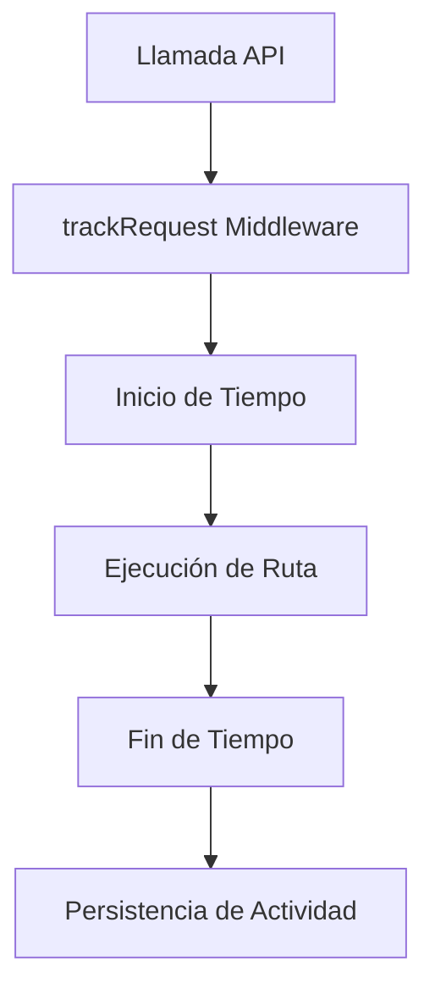
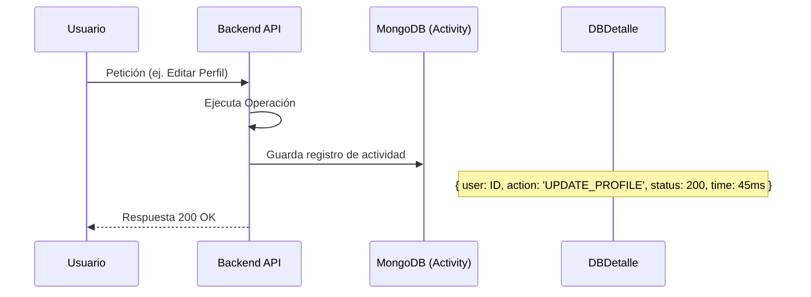

# 05 - Monitoreo y Auditoría (Tracking)

El éxito y la estabilidad de una aplicación serverless dependen de su capacidad para ser observada. Este módulo se encarga de registrar y visualizar la actividad del sistema.

## El Middleware `trackRequest`

Cada interacción con la API pasa por un sistema de trazabilidad que mide el rendimiento y registra el impacto de la operación.

## Especificaciones Técnicas

### Esquemas de Datos (Mongoose)
- **Modelo `Activity`**:
    - `userId` / `visitorId`: Identificación del sujeto (vínculo entre usuario y visitante anónimo).
    - `method` / `path`: Datos técnicos de la petición.
    - `status`: Código de respuesta HTTP.
    - `visitorState`:
        - `ok`: Tráfico legítimo.
        - `suspicious`: Marcado por el sistema de detección de anomalías.
        - `blocked`: Petición rechazada por firewall/Sentinel.
    - `eventType`:
        - `REQUEST`: Tráfico estándar de API.
        - `THREAT`: Evento de seguridad o intento de ataque.
        - `LOGIN`: Registro de inicio de sesión exitoso o fallido.
        - `SYSTEM`: Eventos internos o cambios Críticos.
    - `ipInfo`: Datos geográficos y del ISP (vía IPGuide).

### Endpoints de la API (`/api/panel/analytics`)
- `GET /overview`: Estadísticas generales flash (usuarios, tickets, seguridad hoy).
- `GET /logs`: Auditoría detallada con filtros por IP o ID.
- `GET /traffic-history`: Datos para gráficos de tráfico (últimas 24h o 7 días).
- `GET /threats`: Resumen de bloqueos, IPs top y orígenes de amenazas.
- `GET /visitors/:visitorId/activity`: Historial de sesiones y eventos de un visitante específico.

### Arquitectura de Archivos del Módulo
- **Backend**:
  - `src/models/Activity.ts`
  - `src/middlewares/trackRequest.ts`
  - `src/routes/panel/analytics.ts`
- **Frontend**:
  - `src/pages/admin/dashboard/Overview.tsx`
  - `src/pages/admin/security/SecurityLogs.tsx`
  - `src/pages/admin/security/VisitorTracking.tsx`

## Componentes del Sistema

### Backend: Auditoría y Logging Centralizado
- **Logging Estandarizado**: El sistema utiliza un logger basado en Winston con un formato unificado: `[FECHA] [NIVEL] [MÓDULO]: MENSAJE`.
- **Error Handling con Contexto**: El manejador de errores global (`errorHandler.ts`) ha sido endurecido para capturar automáticamente el contexto del fallo:
    - **IP y User-Agent**: Para identificar si el error proviene de un ataque o un cliente legítimo.
    - **Path y Method**: Ruta exacta del fallo.
    - **UserID**: Si el usuario está autenticado, vincula el error a su cuenta.
    - **Payload de Error**: Logueo del stack trace completo en desarrollo y mensajes sanitizados en producción.
- **DatabaseTransport Inteligente**: Se ha refactorizado el transporte de base de datos para que capture automáticamente la información de la IP (`ipInfo`) en todos los niveles de log (excepto `debug`). Esto asegura que cualquier evento de auditoría o error incluya datos geográficos detallados sin intervención manual en cada ruta.
- **Geolocalización (IPGuide)**: Determina automáticamente la Ciudad, País, Continente, ISP, Organización y ASN del visitante.
- **Limpieza de Consola**: Se eliminaron sistemas de logging redundantes (como `morgan`) para garantizar que la consola solo muestre eventos estandarizados y procesables.
- **Métricas en Tiempo Real**: Almacena indicadores de latencia y lag del event loop en Redis para visualización inmediata.

### Frontend: Analytics Dashboard
- **Visualización de Actividad**: Gráficos interactivos de volumen de tráfico y tasa de bloqueo.
- **Registro de Emails**: Una nueva pestaña en el módulo de correos permite ver cada email enviado, el destinatario, el estado de entrega y los metadatos de seguridad inyectados.
- **Logs de Auditoría**: Interfaz avanzada para búsqueda y filtrado de eventos sospechosos.
- **Panel de Infraestructura**: Visualización de métricas de carga (CPU, RAM, Latencia) extraídas del historial de Redis.
- **Mapa de Amenazas**: (Opcional) Basado en los datos de geolocalización de IPGuide.

### Mantenimiento Automático (Cron Jobs - Serverless Ready)
A diferencia de las aplicaciones tradicionales, en entornos serverless no existen procesos en segundo plano permanentes. Por ello, el sistema utiliza un esquema de **Pull-based Cron**:

- **Concepto**: El sistema expone una ruta HTTP que debe ser invocada periódicamente por un orquestador externo (Vercel Cron Jobs, Railway Scheduler, GitHub Actions, etc.).
- **Archivo**: `src/routes/cron.ts` -> Expone `GET /cron/cleanup`.
- **Tarea**: Purga eventos antiguos de seguimiento de imágenes (`ImageTrackingService.cleanOldEvents`).
- **Seguridad**: Para evitar ejecuciones no autorizadas, la ruta requiere el header `Authorization: Bearer CRON_SECRET`.
- **Configuración Recomendada**: Programar una ejecución diaria (ej: `0 0 * * *`) apuntando a `https://tu-api.com/api/cron/cleanup`.

### Histórico de Métricas de Infraestructura
A diferencia de los logs de actividad, las métricas de infraestructura se almacenan en una ventana deslizante de Redis:
- **CPU y RAM**: Capturadas vía `process.cpuUsage()` y `process.memoryUsage()`.
- **Event Loop Lag**: Medido mediante un `setImmediate` con alta resolución para detectar saturación del servidor.
- **Persistencia**: Últimos 50 puntos de datos en la llave Redis `metrics:latency`.
Para enriquecer los logs de auditoría, se integra el servicio externo `ip.guide`, que permite identificar el origen geográfico e infraestructura del visitante.

- **Integración**: `src/services/ipGuide.ts`.
- **Información Obtenida**:
    - **País/Ciudad**: Para analítica de tráfico.
    - **ISP**: Para detectar redes corporativas o de consumo.
    - **Organización/ASN**: Identifica si la IP pertenece a un centro de datos (Datacenter) o es residencial.
- **Caché con Redis**: Para optimizar el rendimiento y evitar límites de cuota, los resultados se almacenan en Redis durante 24 horas (`EX: 86400`).

### Flujo de Trazabilidad Total
Cuando llega una petición, el middleware `trackRequest` coordina múltiples acciones antes y después de la respuesta:

1. **Identificación**: Captura IP (manejando proxies como Vercel/Railway), User-Agent y IDs de sesión/usuario.
2. **Geolocalización**: Llama a `getIpInfo` (con el fallback de caché en Redis).
3. **Métricas de Performance**:
    - Registra la **latencia** total de la petición.
    - Captura el **Event Loop Lag**, uso de **CPU** y **Memoria RSS**.
    - Almacena un historial circular (Rolling Window) en Redis (`metrics:latency`).
4. **Resumen de Seguridad**: Incrementa contadores diarios en Redis (`security:req` y `security:block`).
5. **Persistencia**: Crea un registro en la colección `Activity` de MongoDB.

## Flujo de Registro de Actividad

## Propósito del Tracking
1.  **Auditoría Forense**: Entender qué causó un error o quién realizó una acción específica.
2.  **Optimización**: Identificar rutas lentas.
3.  **Seguridad**: Detectar escaneos de vulnerabilidades al ver patrones de 404/403 inusuales.
