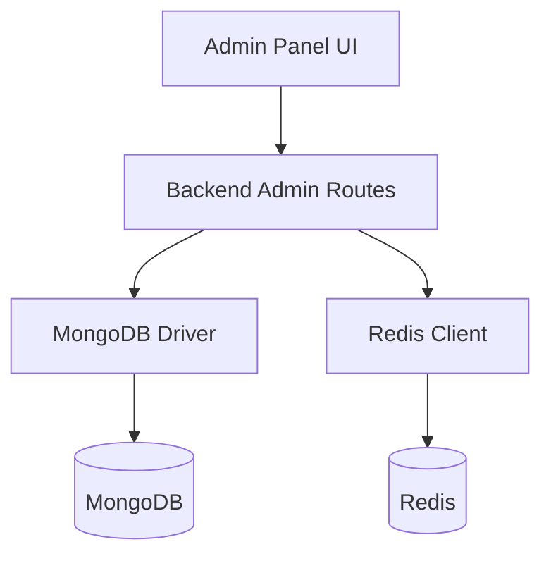
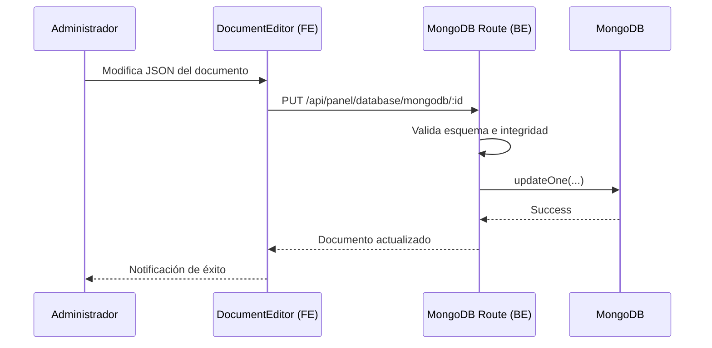

# 06 - Gestión de Bases de Datos (MongoDB & Redis)

El proyecto incluye un conjunto de herramientas administrativas de "bajo nivel" integradas directamente en el panel para facilitar la operación sin salir de la aplicación.

## Arquitectura de Gestión de Datos

El sistema actúa como un cliente directo para interactuar con las colecciones de MongoDB y las llaves de Redis.

## Especificaciones Técnicas

### Esquemas de Datos
Este módulo no posee modelos de negocio propios, ya que su propósito es la **administración directa** de las bases de datos del sistema (interactuando con todos los modelos existentes).

### Endpoints de la API (`/api/panel/system`)

#### Gestión de MongoDB
- `GET /mongodb/collections`: Lista todas las colecciones y sus estadísticas.
- `DELETE /mongodb/collections/:name`: Elimina una colección completa (requiere confirmación por tipeo del nombre).
- `GET /mongodb/collections/:name/documents`: Explorador de documentos con filtros.
- `PUT /mongodb/collections/:name/documents/:id`: Editor JSON de documentos.
- `DELETE /mongodb/collections/:name/documents/:id`: Eliminación de documento (requiere confirmación por tipeo de "DELETE").
- `GET /mongodb/collections/:name/indexes`: Visualización y gestión de índices.

#### Gestión de Redis
- `GET /redis/analysis`: Análisis de patrones de llaves, hit rate y uso de memoria.
- `GET /redis/keys`: Listado y búsqueda de llaves con patrones.
- `GET /redis/keys/:key`: Inspección de valor, tipo y TTL.
- `GET /redis/slowlog`: Historial de comandos lentos para optimización.
- `GET /redis/clients`: Listado de conexiones activas al servidor.
- `GET /redis/info`: Información técnica cruda del motor de Redis.
- `DELETE /redis/keys/:key`: Eliminación manual de llaves.
- `POST /redis/flush`: Vaciado total de la DB (requiere confirmación por tipeo de "CONFIRM").

### Medidas de Seguridad Anti-Errores
Siguiendo las mejores prácticas, todas las operaciones destructivas en el panel de base de datos implementan un **Honeypot de Confirmación** y una **Doble Validación**:
- **Borrados de Colección**: Se requiere escribir el nombre exacto de la colección + Contraseña del Super Admin.
- **Borrados de Documento**: Se requiere escribir la palabra "DELETE" + Contraseña del Super Admin.
- **Vaciado de Redis / Caché**: Se requiere escribir la palabra "CONFIRM" + Contraseña del Super Admin.
- **Limpieza del Sistema**: Se requiere la Contraseña del Super Admin.

> [!IMPORTANT]
> La contraseña es la definida en la variable de entorno `ADMIN_PASSWORD`.

### Arquitectura de Archivos del Módulo
- **Backend**:
  - `src/routes/panel/system.ts`
  - `src/config/redis.ts`
- **Frontend**:
  - `src/components/admin/layout/AdminSidebar.tsx` (Menú desplegable "Base de Datos")
  - `src/pages/admin/database/mongodb/collections-list/`
  - `src/pages/admin/database/mongodb/document-editor/`
  - `src/pages/admin/database/redis/key-explorer/`
  - `src/pages/admin/database/redis/dashboard/`

## Herramientas de MongoDB

### Explorador de Colecciones
Permite listar todas las colecciones de la base de datos, ver el número de documentos y el tamaño ocupado.

### Editor de Documentos
- **Listado Dinámico**: Filtros básicos y paginación para cualquier colección.
- **Edición JSON**: Un editor robusto que permite modificar campos de cualquier documento de forma directa.
- **Gestor de Índices**: Visualización y gestión de índices para asegurar el rendimiento de las consultas.

## Herramientas de Redis

### Key Explorer
- **Escaneo de Llaves**: Visualización de las llaves activas (sesiones, rate limits, caché).
- **Inspección de Valor**: Ver el contenido de una llave (Strings, Hashes, Lists).
- **TTL Manager**: Ver el tiempo restante de vida de cada dato.

### Herramientas de Mantenimiento
- **Flush Cache**: Posibilidad de vaciar selectivamente o totalmente la caché de Redis.
- **Health Check**: Métricas de salud y carga del servidor Redis.

## Flujo de Edición de un Documento

## Seguridad en el Acceso a Datos
Estas herramientas son **críticas**. Solo usuarios con el rol `SUPER_ADMIN` y una sesión verificada en `AdminAuthContext` pueden acceder a estas rutas, las cuales cuentan adicionalmente con logs de auditoría reforzados.
