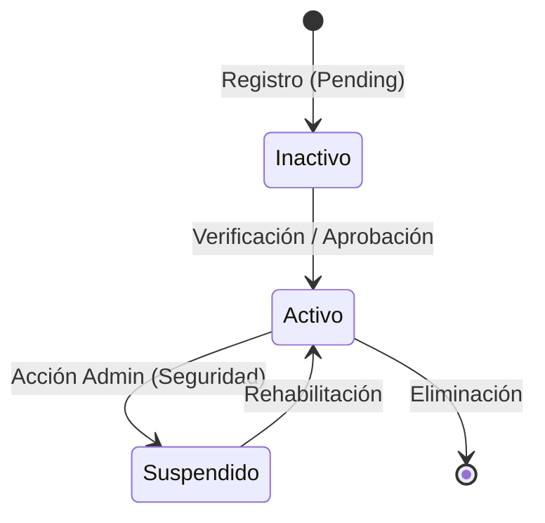
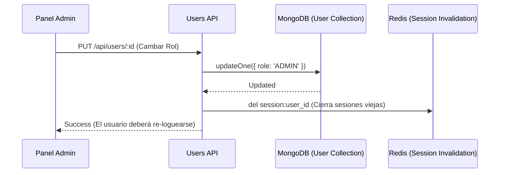

# 07 - Gestión de Usuarios y Roles

Este módulo es la base social del sistema, gestionando la identidad, los permisos y el ciclo de vida de cada cuenta creada en la plataforma.

## Ciclo de Vida del Usuario

Desde el registro hasta la asignación de roles administrativos, el proceso asegura la integridad de la cuenta.

## Especificaciones Técnicas

### Esquemas de Datos (Mongoose)
- **Modelo `User`**:
    - `name` / `email`: Información básica.
    - `passwordHash`: Hash de seguridad (Bcrypt).
    - `role`: `user` o `admin`.
    - `isActive`: Boolean que controla si el usuario puede acceder.
    - `preferences`: Objeto de tipo `Mixed` para ajustes dinámicos (idioma, tema, tours).

### Endpoints de la API (`/api/panel/users`)
- `GET /`: Listado paginado de usuarios con búsqueda.
- `GET /:id`: Detalle completo de un usuario, incluyendo estadísticas y actividad reciente.
- `PATCH /:id`: Actualización de estado (`isActive`) y perfil.
- `GET /:id/sessions`: Listado de sesiones activas (incluye IP info y Device info).
- `DELETE /:id/sessions/:sessionId`: Revocación manual de una sesión.
- `DELETE /:id/sessions`: Revocación masiva de todas las sesiones de un usuario.
- `PATCH /profile`: (Público) Actualización de datos de perfil del usuario.
- `PATCH /preferences`: (Público) Guardado de preferencias personalizadas.

### Arquitectura de Archivos del Módulo
- **Backend**:
  - `src/models/User.ts`, `src/models/Session.ts`
  - `src/routes/panel/users.ts`
- **Frontend**:
  - `src/pages/admin/users/UserList.tsx`
  - `src/pages/admin/users/UserDetail.tsx`
  - `src/pages/admin/users/UserDetailModal.tsx`

## Características Técnicas

### Backend: Modelo y Controladores
- **Modelo `User`**: Almacena credenciales (hasheadas con bcrypt), perfiles, roles (USER, ADMIN, etc.) y metadata de actividad.
- **Validación**: Uso de middlewares para asegurar que solo los dueños de cuenta o administradores puedan editar datos sensibles.
- **Seguridad**: Integración con el sistema de sesiones para forzar deslogueos globales si se cambia una contraseña o rol.

### Frontend: Gestión en el Panel
- **Lista de Usuarios**: Tabla avanzada con búsqueda, filtros por rol y estado.
- **Detalle del Usuario**: Vista completa que incluye el historial de actividad, tickets asociados y configuración de perfil.
- **Control de Roles**: Interfaz intuitiva para cambiar privilegios de forma segura.

## Flujo de Edición Administrativa

## Seguridad de Contraseñas
Las contraseñas nunca se almacenan en texto plano. Se utiliza `bcryptjs` con un factor de costo configurado para resistir ataques de fuerza bruta, y nunca son retornadas en las llamadas a la API (uso de proyecciones negativas en Mongoose).
