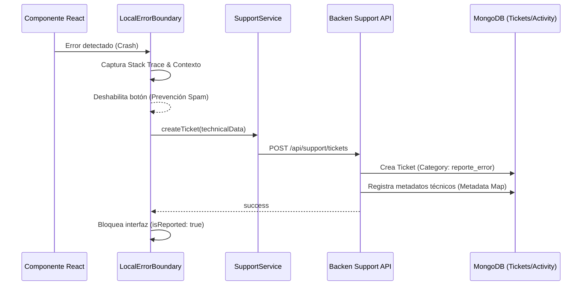

# 09 - Sistema de Soporte y Tickets

El módulo de soporte de **SanttProject** es un ecosistema integral que combina la atención proactiva al usuario mediante **reportes automáticos de errores** y la gestión estructurada de incidencias a través de un panel operativo avanzado.

## Trazabilidad de Errores (ErrorBoundary)

El sistema implementa un centinela inteligente (`LocalErrorBoundary`) que protege la interfaz y permite la recolección forense de datos técnicos ante fallos inesperados.

### Flujo de Reporte Automático

## Especificaciones Técnicas

### Esquemas de Datos (Mongoose)
- **Modelo `Ticket`**:
    - `ticketId`: Identificador único legible (ej. `T-KB4X-A1`).
    - `userEmail` / `userName`: Datos de contacto del solicitante (Guest o Autenticado).
    - `status`: Ciclo de vida (`OPEN`, `IN_PROGRESS`, `RESOLVED`, `CLOSED`).
    - `priority`: Gravedad asignada (`LOW`, `MEDIUM`, `HIGH`, `CRITICAL`).
    - `category`: Tipificación del issue (`soporte`, `contacto`, `reporte_error`).
    - `metadata`: **Objeto flexible (Mixed)** para datos forenses:
        - `error_stack`: El stack trace técnico del fallo.
        - `component_stack`: Árbol de componentes de React.
        - `url`: Página exacta del error.
        - `browser_info`: User-Agent para debug geográfico y técnico.
    - `messages`: Hilo de mensajes con identificación de remitente.

### Endpoints de la API
#### Público (`/api/support`)
- `POST /tickets`: Permite la creación de tickets desde el portal de usuario o de forma automática por el sistema. Soporta inyección de metadatos.

#### Administrativo (`/api/panel/tickets`)
- `GET /`: Bandeja de entrada con filtros multicriterio y ordenamiento por urgencia.
- `GET /:id`: Vista 360° del ticket, incluyendo metadatos técnicos y conversación.
- `POST /:id/reply`: Envío de respuestas oficiales.
- `PATCH /:id/status`: Transición de estados en el flujo de trabajo.

## Arquitectura de Archivos del Módulo

- **Backend**:
  - `src/models/Ticket.ts`: Definición de esquema con soporte para metadatos flexibles.
  - `src/routes/support.ts`: Controlador de entrada pública con extracción de contexto.
  - `src/routes/panel/tickets.ts`: API operativa para resolución de casos.
- **Frontend**:
  - `src/components/ui/ErrorBoundary/LocalErrorBoundary.tsx`: Centinela forense con prevención de duplicados.
  - `src/pages/admin/tickets/TicketDetail.tsx`: Visualizador de tickets con despliegue de detalles técnicos.
  - `src/services/support/supportService.ts`: Cliente de API para envío unificado.
  - `src/services/support/types.ts`: Definición estricta de esquemas de reporte.

## Prevención de Spam y Duplicados

Para garantizar la integridad de la base de datos y evitar saturación por comportamientos repetitivos:
1.  **Button Disabling**: El botón de reporte se deshabilita instantáneamente al primer clic mediante un estado local `isReporting`.
2.  **Persistence Layer**: Una vez que el servidor confirma la creación del ticket, el componente cambia a `isReported: true`, bloqueando cualquier intento posterior de envío para ese mismo error en la sesión actual.
3.  **Visual Feedback**: El usuario recibe una notificación inmediata (Toast) indicando que su información técnica ya está en manos del equipo de soporte.

## Análisis Forense Administrado

Los tickets de tipo `reporte_error` se distinguen en el panel de administración por su alta prioridad y la disponibilidad de un bloque de **"Detalles Técnicos"** que permite a los desarrolladores diagnosticar el problema sin necesidad de pedir capturas de pantalla o logs adicionales al usuario.
