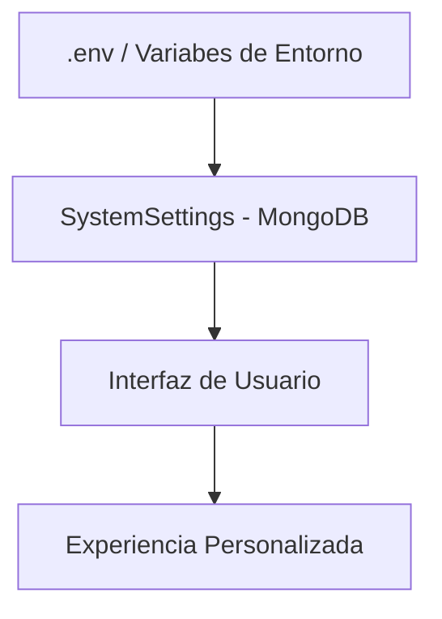
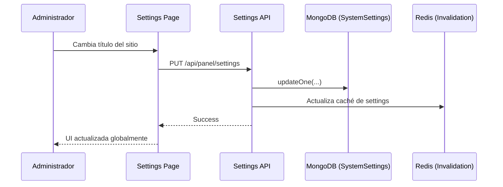

# 10 - Configuración del Sistema y Ajustes

Este módulo gestiona la personalización global de la plataforma, desde las variables de entorno técnicas hasta las preferencias de usuario y el comportamiento de la UI.

## Aislamiento de Proyectos (Multi-Tenancy)

El sistema utiliza la variable `PROJECT_ID` para garantizar que múltiples instancias de la plantilla puedan convivir en la misma infraestructura sin pisar datos:

- **MongoDB**: Crea automáticamente una base de datos con el nombre de `PROJECT_ID`.
- **Cloudinary**: Organiza todos los archivos bajo la carpeta raíz `/${PROJECT_ID}/`.
- **Redis**: Prefija todas las llaves de seguridad y caché con `${PROJECT_ID}:`.

Esto permite aislar completamente el entorno de cada cliente o proyecto con solo cambiar un valor en el archivo `.env`.

## Jerarquía de Configuración

La configuración fluye desde lo más estático (servidor) hasta lo más dinámico (interfaz de usuario).

## Especificaciones Técnicas

### Esquemas de Datos (Mongoose)
- **Modelo `SystemSettings`**:
    - `key`: Identificador de la configuración (default: `general`).
    - `appName`: Nombre global de la aplicación.
    - `currency`: Moneda del sistema (ARS, USD, etc).
    - `timezone`: Zona horaria por defecto.
    - `maintenanceMode`: Switch global para desactivar la API pública.

### Endpoints de la API (`/api/panel/system`)
- `GET /settings`: Obtiene la configuración global.
- `PUT /settings`: Actualiza los parámetros del sistema.
- `GET /metrics`: Estadísticas de rendimiento del servidor y recursos.
- `POST /seeds`: Ejecución manual de semillas para desarrollo.
| Variable | Ejemplo | Descripción |
|---|---|---|
| `CORS_ORIGIN` | `http://localhost:5173` | Orígenes permitidos para peticiones API. |
| `PROJECT_ID` | `santtproject` | Identificador único del proyecto. Controla el nombre de la BD MongoDB, carpetas de Cloudinary y prefijos de Redis. |
- `GET /cleanup/estimate`: Previsualización de espacio recuperable (logs, métricas).
- `POST /cleanup/execute`: Ejecución de borrado profundo (requiere `ADMIN_PASSWORD`).

### Herramientas de Auditoría e Infraestructura

#### Modo de Mantenimiento
- **Funcionamiento**: El campo `maintenanceMode` en `SystemSettings` detiene el tráfico público.
- **Middleware**: La lógica global retorna `503 Service Unavailable` a toda petición que no provenga de un usuario con rol `admin`.

#### Limpieza Profunda del Sistema
El sistema incluye un `CleanupService` diseñado para mantener el crecimiento de la base de datos bajo control:
- **Corte Temporal**: Se basa en la configuración de `retentionDays` (default: 90 días).
- **Objetos Afectados**:
  - `ImageMetric`: Elimina eventos individuales de visualización antiguos.
  - `Activity`: Borrado de logs de auditoría antiguos.
- **Seguridad**: Solo ejecutable por un super administrador mediante validación de contraseña.

#### Diagnóstico de Caché (Redis)
El sistema integra herramientas de bajo nivel para asegurar el rendimiento:
- **Slowlog**: Identificación de cuellos de botella en consultas a Redis.
- **Client List**: Monitoreo de conexiones activas para prevenir fugas en lambdas/funciones cloud.
- **Redis Info**: Acceso a estadísticas de fragmentación y uso de memoria en tiempo real.
- **Flush Cache**: Vaciado total de la base de datos de caché.

### Arquitectura de Archivos del Módulo
- **Backend**:
  - `src/models/SystemSettings.ts`
  - `src/config/env.ts` (Centralización técnica).
  - `src/services/CleanupService.ts`.
  - `src/routes/panel/system.ts`, `src/controllers/panel/systemController.ts`.
- **Frontend**:
  - `src/pages/admin/settings/Settings.tsx`
  - `src/pages/admin/settings/SeedsPage.tsx`
  - `src/pages/admin/settings/SystemMetrics.tsx`
  - `src/contexts/ThemeContext.tsx`, `src/contexts/LanguageContext.tsx`.

## Áreas de Configuración

### Backend: Ajustes Globales
- **SystemSettings**: Una colección en MongoDB que almacena configuraciones que pueden cambiar sin reiniciar el servidor (ej. nombre del sitio, modo mantenimiento, límites de subida).
- **Entorno (env.ts)**: Centralización de claves de API, URLs de bases de datos y secretos de JWT. Valida que todas las llaves necesarias existan al arrancar.

### Frontend: Experiencia de Usuario
- **Internacionalización (i18n)**: Manejado a través del hook `useLanguage` y archivos de traducción centralizados. Soporta cambios de idioma en tiempo real.
- **Tours Interactivos**: Uso de `useTour` y `useAutoTour` para guiar a los nuevos usuarios en el panel administrativo.
- **Preferencias Visuales**: Temas (claro/oscuro) gestionados vía `ThemeContext`.

## Flujo de Cambio de Configuración Global

## Robustez de Configuración
El sistema utiliza valores por defecto (*fallbacks*) en caso de que alguna configuración falte o sea inválida, asegurando que la aplicación no colapse ante configuraciones erróneas.
