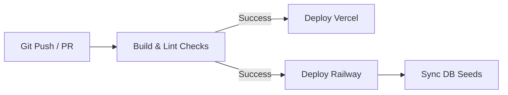
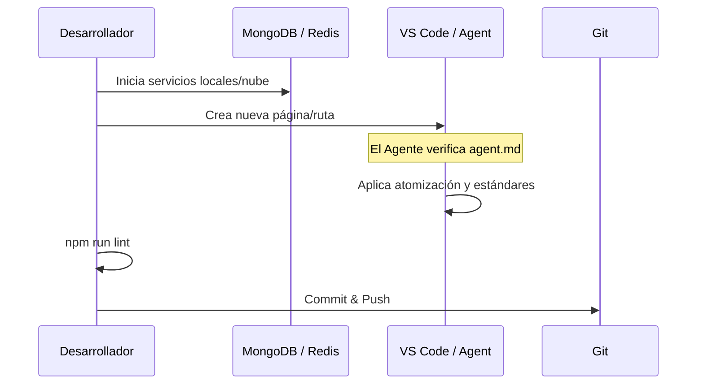

# 11 - Guía del Desarrollador y Despliegue

Este documento sirve como manual de estándares y procedimientos para mantener la calidad y consistencia del proyecto a largo plazo.

## Estándares de Codificación

Seguimos una filosofía de limpieza y consistencia extrema, reforzada por los archivos `agent.md` en cada módulo.

### Backend (Express/TS)
- **Controladores Delgados**: La lógica debe estar en `src/services/`.
- **Naming**: `camelCase` para funciones y archivos asíncronos.
- **Middlewares**: Siempre usar `asyncHandler` para evitar bloqueos por errores no capturados.
- **Logging**: 
  - Usar `logAudit` para acciones de negocio (ej. `ticket_created`, `profile_updated`).
  - Usar `logAuth` para eventos de identidad (ej. `login`, `register`).
  - El sistema capturará la IP y geolocalización automáticamente.

### Frontend (React/TS)
- **Atomización Absoluta**: Si un componente supera las 150 líneas, debe dividirse.
- **Naming**: `PascalCase` para carpetas de componentes y sus archivos `index.tsx`.
- **Styles**: Uso obligatorio de la utilidad `cn()` para clases de Tailwind.
- **Patrones de UI Reutilizables**:
  - **Sidebar Colapsable**: Optimización de espacio en escritorio.
  - **UserMenu**: Componente unificado en el header para acciones de perfil y logout.
  - **Badges de Estado**: Sistema estandarizado para mostrar estados (`success`, `warning`, `error`).

## Flujo de Despliegue (CI/CD)

## Variables de Entorno (Backend)

| Variable | Propósito | Requerido |
| :--- | :--- | :--- |
| `NODE_ENV` | Entorno (`development`, `production`). | No |
| `PORT` | Puerto de escucha (default: 4000). | No |
| `MONGODB_URI` | String de conexión a MongoDB. | **Sí** |
| `MONGODB_DB` | Nombre de la DB (default: `marketplace_serverless`). | No |
| `REDIS_URL` | String de conexión a Redis (Upstash/Railway). | **Sí** |
| `JWT_SECRET` | Secreto para firmas de Access Token. | **Sí** |
| `REFRESH_SECRET` | Secreto para firmas de Refresh Token. | **Sí** |
| `ADMIN_EMAIL` | Email del usuario administrador por defecto. | **Sí** |
| `ADMIN_PASSWORD` | Contraseña del administrador por defecto. | **Sí** |
| `CLOUDINARY_CLOUD_NAME` | Identificador de Cloudinary. | **Sí** |
| `CLOUDINARY_API_KEY` | Key de la API de Cloudinary. | **Sí** |
| `CLOUDINARY_API_SECRET` | Secreto de la API de Cloudinary. | **Sí** |
| `CORS_ORIGIN` | URL permitida para el frontend. | No |
| `CRON_SECRET` | Token Bearer para autorizar tareas programadas. | **Sí** |

## Trust Proxy y Serverless
Dado que la aplicación está diseñada para correr detrás de un proxy inverso (como el de Vercel o Railway), se implementa una lógica de captura de IP robusta:
- **Prioridad**: Se busca en el header `x-forwarded-for`.
- **Identidad**: El middleware `identifyUser` permite que un gateway externo (Edge Computing) inyecte el `userId` en los headers de forma segura.

## Sistema de Seeds (Semillas)

Para desarrollo y pruebas, contamos con un sistema de poblamiento de datos automatizado:
1.  **Limpieza**: Vacía las colecciones críticas.
2.  **Inyección**: Inserta usuarios admin, tickets iniciales y configuraciones base.
3.  **Comando**: `npm run seed` desde el backend.

## Flujo de Desarrollo Sugerido

## Recursos Adicionales
- **Logs de Error**: Revisar siempre el sistema de seguimiento de errores en producción (Vercel/Railway Dashboard).
- **Documentación de API**: Cada cambio en rutas debe reflejarse en los documentos de esta carpeta `/docs`.
