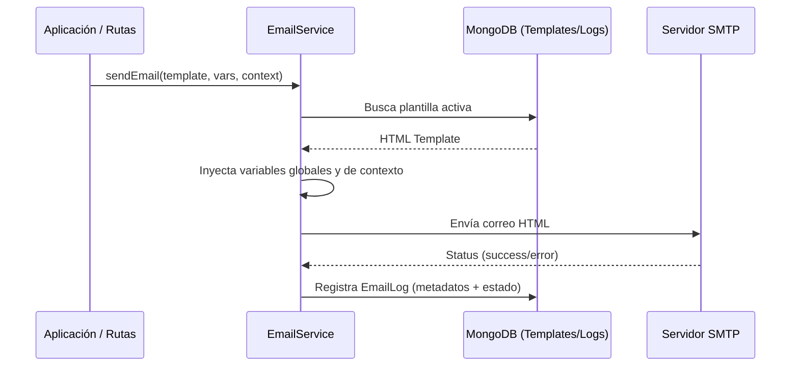

# 12 - Gestión de Emails y Trazabilidad

El sistema de correos electrónicos de **SanttProject** ha sido diseñado para ofrecer una comunicación profesional, segura y altamente auditable, integrando plantillas dinámicas con el motor de seguridad **Sentinel**.

## Arquitectura de Envío

El sistema utiliza un flujo centralizado donde cada correo no solo se envía, sino que se persiste para su análisis histórico y métricas.



## Especificaciones Técnicas

### Esquemas de Datos (Mongoose)
- **Modelo `EmailTemplate`**:
    - `name`: Identificador único (ej. `verification`, `password-reset`).
    - `subject`: Asunto dinámico con soporte para variables.
    - `body`: Contenido HTML de la plantilla.
    - `variables`: Array de strings con las variables requeridas.
    - `isActive`: Control de disponibilidad.
- **Modelo `EmailLog`**:
    - `recipient`: Correo del destinatario.
    - `templateName`: Nombre de la plantilla utilizada.
    - `status`: `success` o `failed`.
    - `metadata`: Objeto con todos los valores inyectados (IP, nombre, link, etc).
    - `error`: Mensaje técnico en caso de fallo en el transporte.

### Endpoints de la API (`/api/panel/emails`)
- `GET /metrics`: Estadísticas de envío (30 días), tasas de entrega y fallos.
- `GET /logs`: Auditoría detallada con búsqueda por destinatario y paginación.
- `GET /templates`: Listado de plantillas disponibles.
- `PATCH /templates/:id`: Edición en tiempo real del contenido y asunto.
- `POST /test`: Envío de prueba para validación de renderizado.

## Arquitectura de Archivos del Módulo

- **Backend**:
  - `src/models/EmailTemplate.ts`: Definición de plantillas.
  - `src/models/EmailLog.ts`: Persistencia de auditoría.
  - `src/services/EmailService.ts`: Lógica de inyección y motor de envío.
  - `src/routes/panel/emails.ts`: API administrativa de gestión.
  - `src/scripts/seedEmails.ts`: Script de inicialización de marca y diseño.
- **Frontend**:
  - `src/pages/admin/emails/EmailDashboard.tsx`: Dashboard principal.
  - `src/pages/admin/emails/components/EmailLogs.tsx`: Visualizador de auditoría.
  - `src/services/admin/emailService.ts`: Cliente de API para gestión de correos.

## Integración con Seguridad (Sentinel)

El módulo de emails es una pieza crítica en la defensa del sistema:
1.  **Contexto de Seguridad**: Cada correo sensible incluye automáticamente la **IP**, el **Dispositivo** y el **Timestamp** de la solicitud, permitiendo al usuario detectar accesos no autorizados.
2.  **Prevención de Abuso**: Las rutas de envío están protegidas por el Sentinel Risk Score, bloqueando IPs que intentan realizar ataques de enumeración de cuentas.

## Referencia de Variables Globales

Todas las plantillas inyectan automáticamente el siguiente contexto:
| Variable | Descripción |
| :--- | :--- |
| `{{appName}}` | Nombre de la aplicación (SanttProject). |
| `{{supportUrl}}` | Enlace directo al centro de soporte interno. |
| `{{datetime}}` | Fecha y hora exacta (UTC) de la operación. |
| `{{ip}}` / `{{userAgent}}` | Datos de origen para auditoría del usuario. |
| `{{currentYear}}` | Año actual para el pie de página legal. |

## Mantenimiento y Branding

Para sincronizar o resetear el branding corporativo en las plantillas, utilice el comando de inicialización:
```bash
cd backend && npx tsx src/scripts/seedEmails.ts
```
Este comando garantiza que todas las plantillas sigan los estándares estéticos premium de **SanttProject** y cuenten con soporte para botones CTA y enlaces de respaldo.
